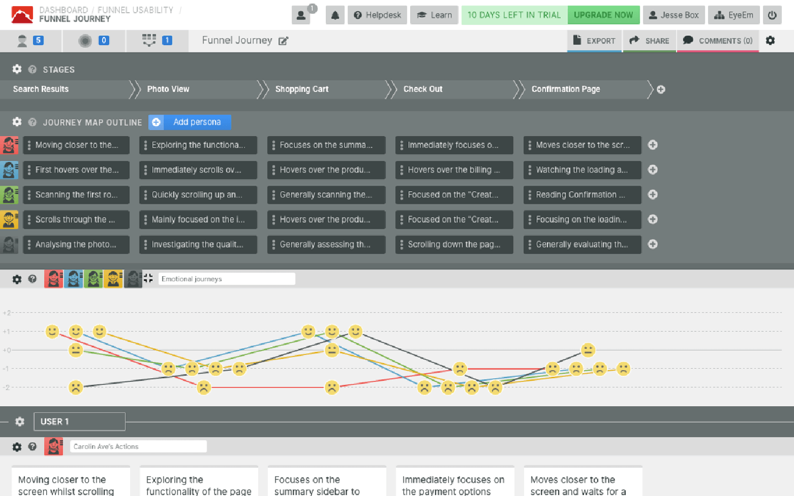
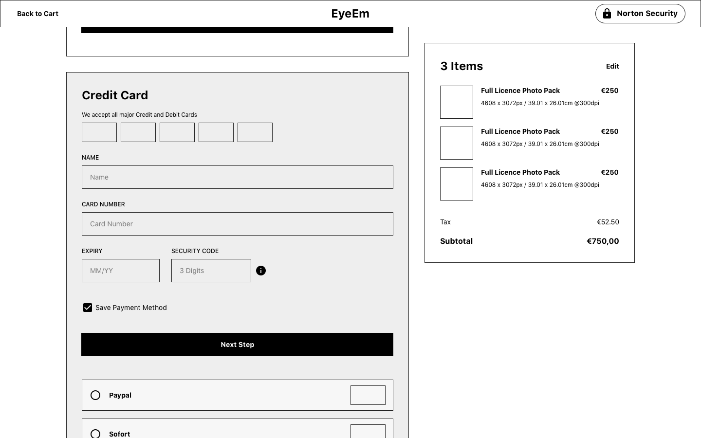

Before I start, I want to say that quantitative data is a great thing. It's a great thing because it provides behavioural insights for the services you're building. With it, you're answering the question "what's happening on our service?" but to find the right problems to solve, you'll also need to answer "how come?".

This isn't some big secret, and the intention of this post isn't to talk about the value of gathering qualitative insights instead highlighting the potential issues when a team leans too heavily on quantitative data to make decisions. To help illustrate my points, I will use one of my own projects which improved the conversion rate of EyeEm's checkout experience.

For those unaware of what EyeEm does, they enable photographers to sell their work through our marketplace or our partners.

### ~~User~~ Company problems

As I said earlier, quantitative insights tell you the "what" but not the "how" and without it, you'll be left speculating how to solve the issues your users face with your service. Making bets is clearly a risky position to be in, but at the end of the day, you've got to make a decision that best serves the interests of your company.

Why we focused on improving the EyeEm's checkout experience in the first place was because the monthly revenue targets the business set for itself were below projections. You might be thinking "Hang on, there could be probably several issues not related to checkout which attribute to less-than-expected revenue, why start there?" What we saw when reviewing our quantitative data was while the majority of people dropped off when browsing for photos, there was still a lot of remaining people accessing the checkout flow which neglected to make a transaction.

If you want to improve revenue metrics, it seems like the safest bet is to target the area of your service where the users intent is pretty straightforward — buy a photo.

Making bets aside, to further our understanding of checkout experiences, we conducted usability studies with our colleagues, synthesised additional quantitative data and summarised other studies conducted from research institutes such as Nielsen Norman Group and Baymard Institute.

In the end, the bets we made were:

1. Enable transactions to be made from all across the globe.
2. Add more payment methods for our new international users.
3. Remove our signup step for first-time users
4. Improve the user interface to support the user through the checkout process.

### Quality output ≠ product success

I think we made the best decisions we could have made for the checkout, but we only saw modest success from it, and that's the problem. Our team could comfortably say "job well done", but we couldn't tell you if users really wanted an improved checkout experience in the first place. Quantitative data will indicate many problems with your service, but it won't tell you how it becomes a problem and how significant that problem is to solve.

In my view, a user getting to know a service will evaluate 3 things.

1. Does this service solve the problems I experience?
2. Does this service solve them well? and
3. Does this service solve the problems in a way that I personally resonate with?

Making safe bets mean you're struggling to meet point two on this list because you're not going to be irresponsible and try to assume too much with the little data you have. Safe bets will also lead to small wins, and after a while, you'll probably start to wonder when the sum of these wins will add up to any considerable milestone.

### Moving forward

We made the changes to the checkout in early 2019, ancient history by product standards, but I felt it was an excellent example to illustrate my point. Today my team is actively engaging with its users, and I know we feel more comfortable tackling big problems users are asking to be solved. Seeing that I've never been apart of a team that genuinely "user-centric", it is an excellent opportunity for me to learn how to best engage with our users.

<YouTube youTubeId="rmM0kRf8Dbk" />{" "}

I'll leave you with this video featuring Don norman sharing his approach to "Human-Centered Design" because at the end of the day I'm just parroting what he's said for the past 30 odd years.
